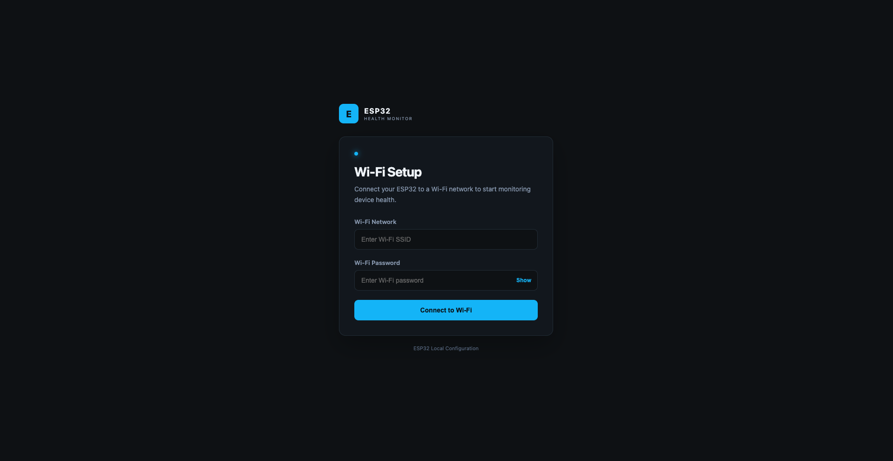
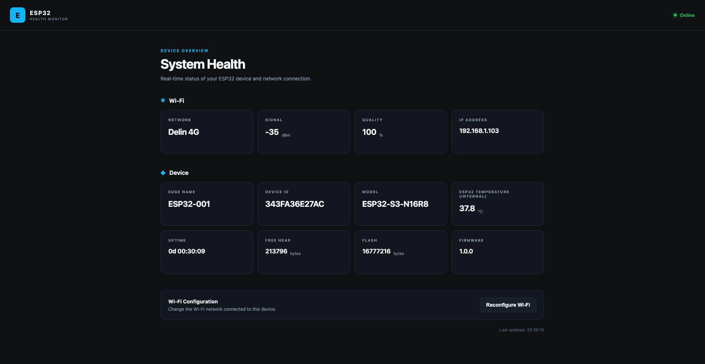
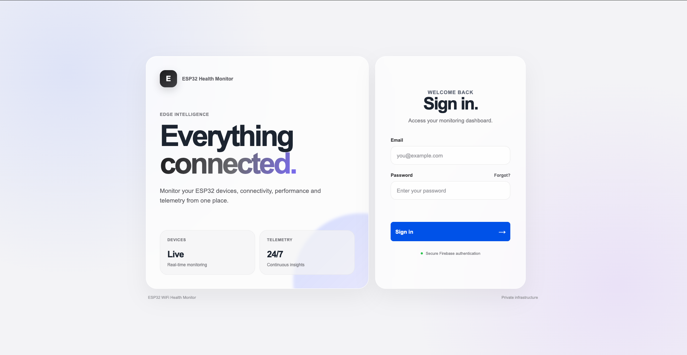
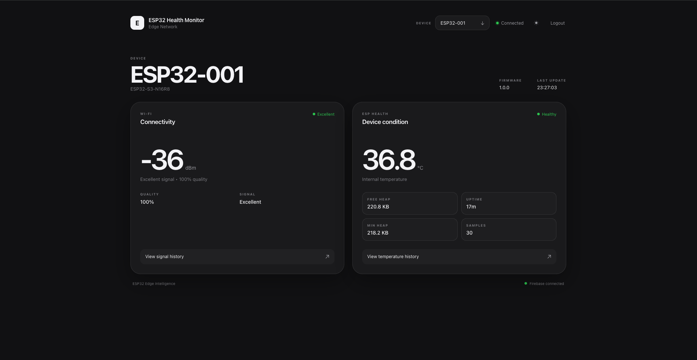
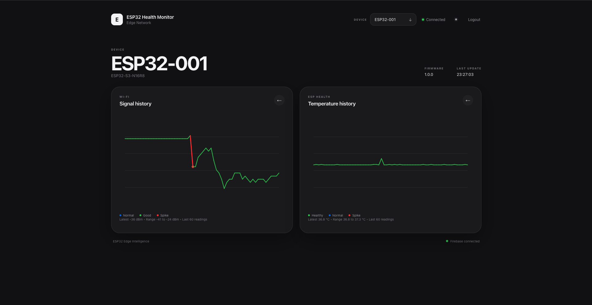
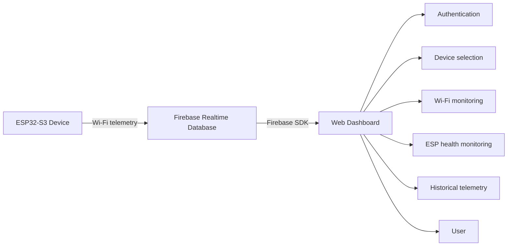

# ESP32 WiFi Health Monitor

A real-time ESP32 monitoring project that combines embedded firmware, Firebase Realtime Database, and a browser-based dashboard to track Wi-Fi health and device status from the edge.

This repository is organized into two primary parts:

- [firmware](firmware) — ESP32-S3 firmware that collects telemetry and connects to Firebase
- [dashboard](dashboard) — Firebase-backed web dashboard for monitoring devices and viewing telemetry

The project is currently under active development and is intended as a practical example of an ESP32-based IoT monitoring workflow.

## Screenshots

### Firmware WiFi Config



### Firmware Dashboard



### Dashboard login



### Dashboard overview



### ESP32 telemetry / serial output



## Overview

This project focuses on a simple but useful architectural pattern:

1. An ESP32-S3 board runs firmware and collects system and Wi-Fi telemetry.
2. The device connects to Wi-Fi and publishes data to Firebase Realtime Database.
3. A Vite-based web dashboard authenticates with Firebase and reads device telemetry.
4. A user can select a device, view current metrics, and inspect historical graph data.

The current system is centered on monitoring device behavior and connection quality rather than broader automation or cloud services beyond Firebase.

## Architecture



## Current functionality

The repository currently includes the following implemented functionality:

- ESP32-S3 firmware
- Device configuration values for edge name, model, and firmware version
- Wi-Fi connection handling and saved credentials flow
- Firebase Authentication for the dashboard
- Firebase Realtime Database integration
- Device registration and telemetry publishing
- ESP runtime telemetry collection:
  - Wi-Fi RSSI
  - Wi-Fi quality
  - Internal temperature
  - Free heap
  - Minimum free heap
  - Sample count
  - Uptime
  - ESP timestamp
  - Server timestamp
- RGB status LED control for the onboard programmable LED
- Firmware logging via a structured logger module
- Vite-based dashboard with multiple HTML entry points
- Login/logout flow
- Device selector
- Wi-Fi monitoring cards and history
- ESP health monitoring cards and history
- Light/dark mode UI
- Firebase Hosting deployment target for the dashboard

## Current limitations and known gaps

Some important limitations are worth documenting clearly:

- Firebase connection state and the actual ESP32 device online/offline state are not the same thing.
- The project currently does not implement a reliable heartbeat or last-seen mechanism for determining whether an ESP32 is still physically online.
- This means a browser may still show Firebase connectivity while the ESP32 has been powered off or disconnected.
- The repository is under active development, and some monitoring and device-management features are still evolving.

This is a planned improvement area rather than an implemented feature.

## Firmware

The firmware targets the ESP32-S3 N16R8 board and is built with PlatformIO and the Arduino framework.

Key firmware characteristics currently implemented:

- Wi-Fi setup and reconnection logic
- Device configuration abstraction
- Firebase authentication and database publishing
- Structured firmware logging
- LED state signaling for boot and runtime status
- Local device web server functionality for setup and diagnostics

The firmware uses a device configuration layer with values such as:

- `EDGE_NAME = ESP32-001`
- `DEVICE_MODEL = ESP32-S3-N16R8`
- `FIRMWARE_VERSION = 1.0.0`

These configuration values are intended to allow different boards or device instances to carry their own identity without changing the core firmware logic.

The onboard programmable RGB LED is connected to GPIO 48 for the current board, and the LED functionality is managed via a dedicated module rather than scattered throughout the firmware.

For deeper implementation details, see [firmware/README.md](firmware/README.md).

## Dashboard

The dashboard is a Vite-based frontend designed to connect to Firebase and visualize the ESP32 devices being monitored.

It includes:

- Authentication flow
- Login and logout
- Device selector at the top of the interface
- Firebase Realtime Database reads
- Wi-Fi telemetry views
- ESP health telemetry views
- Latest-value cards and historical graph views
- Card/history view switching
- Light and dark mode
- Device information and firmware version display

The dashboard is intentionally minimal and uses a clean, card-based interface with a modern, bento-style visual approach.

The dashboard includes multiple HTML entry points:

- `index.html`
- `login.html`
- `dashboard.html`

The Vite configuration supports these as split entry points, and production builds are written to the `dist/` folder.

For deeper frontend implementation details, see [dashboard/README.md](dashboard/README.md).

## Firebase

Firebase is used as the project backend for:

- Firebase Authentication
- Firebase Realtime Database
- Firebase Hosting

The dashboard uses the Firebase JavaScript SDK and stores its web configuration in environment variables rather than in source files.

The Vite app expects values with the `VITE_` prefix because it is built using Vite.

The project is designed so that Firebase configuration and credentials live outside the public source tree. The repository root currently includes a `.gitignore` entry for `.env`, which helps prevent local environment files from being committed.

Do not commit actual Firebase values, API keys, database URLs, user credentials, or `.env` files to a public repository.

## Hardware

The confirmed hardware currently documented in the project is:

- ESP32-S3 N16R8 board
- Onboard programmable RGB LED on GPIO 48

No additional sensors or hardware are currently described in the repository beyond this confirmed setup.

## Telemetry

The ESP32 firmware currently collects telemetry relevant to Wi-Fi and device health, including:

- RSSI
- Wi-Fi quality
- Internal temperature
- Free heap
- Minimum free heap
- Sample count
- Uptime
- ESP timestamp
- Server timestamp

Telemetry is stored in the Firebase Realtime Database under the device structure, and the dashboard reads the selected device's telemetry for display.

## Wi-Fi monitoring

The Wi-Fi section displays current connection health and signal-related values such as:

- RSSI
- Wi-Fi quality
- Signal classification

The current signal classification logic is threshold-based and categorizes values such as:

- Excellent
- Good
- Normal
- Weak
- Critical

Historical Wi-Fi graphs display RSSI trends, and the dashboard distinguishes normal readings from significant spikes based on thresholds rather than a machine-learning or anomaly-detection model.

## ESP health monitoring

The ESP health section displays information including:

- Internal temperature
- Free heap
- Minimum free heap
- Sample count
- Uptime
- Health status

Health status is currently derived from threshold-based logic using temperature and available heap conditions. This is operational monitoring, not AI-based health prediction.

## Dashboard monitoring model

The dashboard is organized around a single-card overview model where users can switch between:

- the current/latest telemetry view
- the historical graph view

This is intentional and avoids showing several large graphs at once; it keeps the interface cleaner and more focused.

## Logging

The firmware includes a dedicated logger framework to replace scattered `Serial.print` and `Serial.println` calls with a more structured format.

The logger module defines log levels and adds consistent source tagging for messages emitted by different subsystems. This improves debugging and makes the serial output easier to read during development and troubleshooting.

The actual implementation includes debug, info, warn, and error levels.

## Project structure

The repository currently contains the following main areas:

```text
esp32-wifi-health-monitor/
├── README.md
├── .gitignore
├── dashboard/
│   ├── README.md
│   ├── package.json
│   ├── vite.config.js
│   ├── firebase.json
│   ├── index.html
│   ├── login.html
│   ├── dashboard.html
│   └── src/
│       ├── css/
│       └── js/
├── firmware/
│   ├── README.md
│   ├── platformio.ini
│   ├── dummy.env
│   ├── extra_script.py
│   ├── include/
│   ├── src/
│   ├── data/
│   └── test/
└── LICENSE (if present in a future branch or release)
```

The core structure is intentionally split between embedded firmware and frontend logic, with documentation kept in each major component folder.

## Getting started

### Prerequisites

Before using the project, ensure you have:

- Node.js and npm installed for the dashboard
- PlatformIO installed for the firmware
- A Firebase project configured with Authentication and Realtime Database
- An ESP32-S3 board connected for firmware upload
- A Wi-Fi network available for the device

### Dashboard setup

From the dashboard folder:

```bash
cd dashboard
npm install
npm run dev
```

This starts the Vite development server.

To produce a production build:

```bash
npm run build
```

The output is generated into the `dist/` directory.

To preview the production build locally:

```bash
npm run preview
```

### Firmware setup

From the firmware folder:

```bash
cd firmware
cp dummy.env .env
```

Then edit the `.env` file with your Firebase configuration values and local device settings. The actual credentials and configuration values should never be committed to a public repository.

Build and flash the device with PlatformIO:

```bash
pio run -t upload
```

If the project assets or web files need to be uploaded to the device filesystem, use:

```bash
pio run -t uploadfs
```

## Environment configuration

The dashboard uses `.env` files during development and build-time configuration with Vite.

The required environment variables use the `VITE_` prefix because the frontend is Vite-based.

These values are used for Firebase web configuration rather than to store sensitive secrets in the repository.

The repository root `.gitignore` already includes `.env`, and the local environment file should remain untracked.

## Firebase hosting and deployment

The dashboard is intended to be deployed with Firebase Hosting.

The Firebase Hosting configuration in the dashboard project points to the production build output in `dist/`.

Typical deployment flow:

```bash
cd dashboard
npm run build
firebase deploy
```

This project does not expose any Firebase credentials or deployment secrets in this documentation.

## Documentation

This repository keeps implementation details in sub-project documentation to avoid duplication in the main landing page.

Relevant documentation:

- [firmware/README.md](firmware/README.md)
- [dashboard/README.md](dashboard/README.md)

## Current status

The project is currently a working prototype/active development project focused on:

- ESP32 telemetry collection
- Wi-Fi and system-health monitoring
- Firebase-backed persistence
- Browser-based dashboard visualization

It is not positioned as a fully mature production product yet, and active development continues.

## Roadmap

The following areas are relevant to future work and are consistent with the current project direction:

- Reliable device online/offline detection using heartbeat or last-seen logic
- Improved dashboard workflows and device management
- Additional telemetry and signal diagnostics
- Better historical trend management
- Further monitoring refinements for operational use

These items are planned or future improvements and not claimed as implemented features.

## Security

This project includes the following security expectations:

- Do not commit `.env` files or any other secret material to version control
- Do not expose Firebase API keys, credentials, or deployment secrets in public source files
- Use Firebase Authentication for dashboard access
- Configure Firebase Realtime Database rules appropriately for your environment
- Treat client-side Firebase configuration as only one layer of the overall security model

The frontend configuration and Firebase credentials must never be hardcoded into a public GitHub repository.

## Troubleshooting

Common issues and how to interpret them:

### Dashboard errors or missing Firebase config

- Confirm that the dashboard `.env` file exists and includes the required `VITE_` environment variables
- Restart the Vite dev server after changing environment variables
- Verify the Firebase web config values are correct
- Make sure the configuration is not being committed to the repository

### Dashboard loads but data is empty

- Check Firebase database connectivity
- Confirm the ESP32 has successfully connected to Wi-Fi
- Confirm the device is registering and publishing telemetry to the expected database paths

### ESP32 telemetry is not appearing

- Check the board serial output for Wi-Fi and Firebase logs
- Confirm the `.env` file is present and valid for the firmware
- Verify Firebase Authentication and Realtime Database access are configured correctly
- Check whether the device is connected to Wi-Fi and whether the Firebase client is initialized correctly

### Device appears connected in Firebase even after power is removed

This is a current limitation of the project: Firebase connectivity and a device's actual online/offline status are not the same thing. A browser can remain connected to Firebase even if the ESP32 is powered off. A proper heartbeat or last-seen mechanism is still a planned improvement.

## Contributing

Contributions are welcome as long as they remain consistent with the actual project direction.

Suggested contribution areas include:

- firmware improvements
- telemetry and logging improvements
- dashboard usability improvements
- Firebase integration refinements
- documentation updates

Please keep changes focused, avoid exposing secrets, and document any new configuration requirements clearly.

## License

This repository does not currently declare a project license in the files inspected here. If a license is added later, it should be clearly documented in the root of the repository before public release or reuse.

Until then, treat the project as source code for a community development project and respect any upstream repository licensing terms if they are introduced later.
